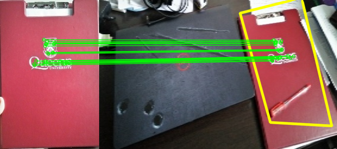

# Object detection and tracking

It uses ORB() feature extraction, Homography and Perspective Transform to detect the location and allignment of an object(img1) in 2nd image(img2).

## Clone the repository

git clone https://github.com/smajum-AI/Object_detect_and_track.git

## Testing

Run 'Detection_and_Localization.py'

For Real-time detection, uncomment the '#' lines and initialize the camera. Place the desired object to be tracked in Pictures folder under 'object.jpg' name.

